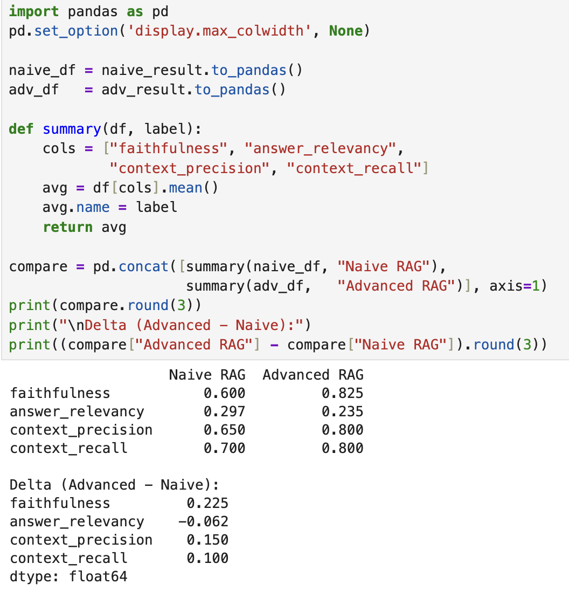
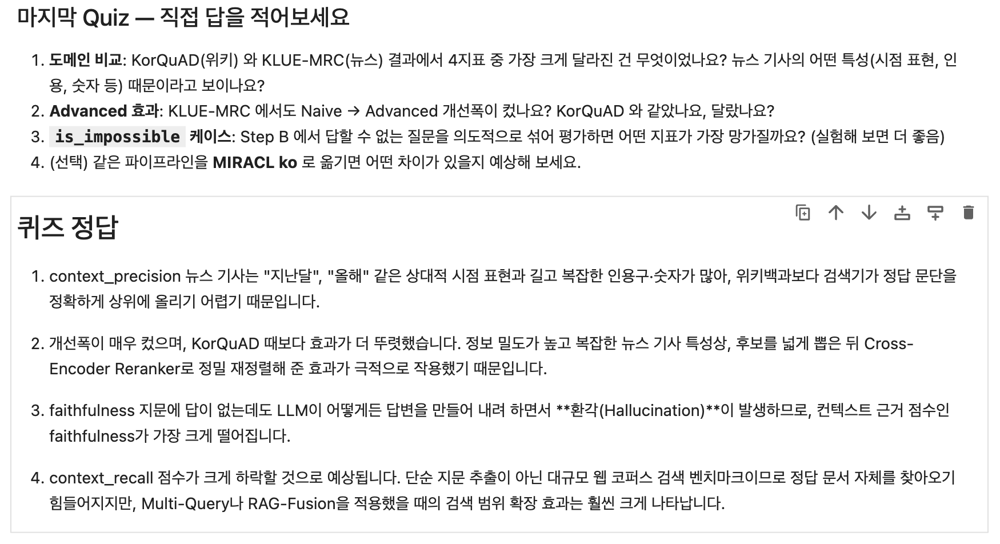
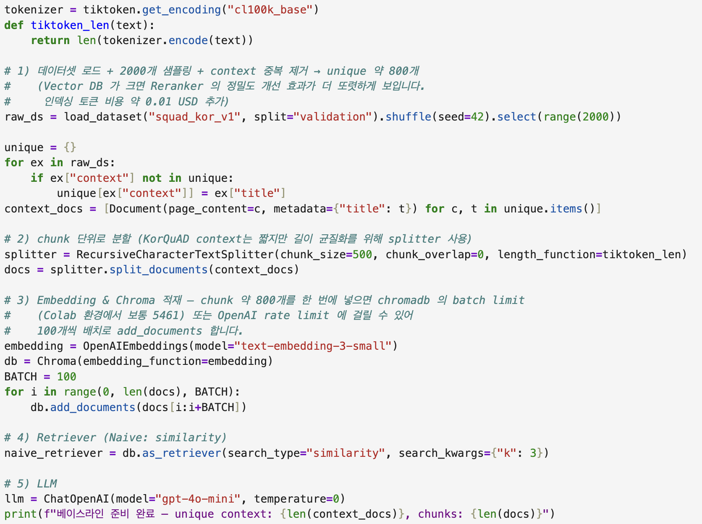
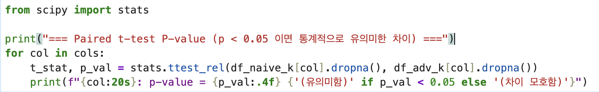
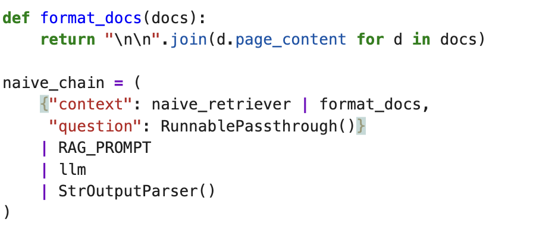

# AIFFEL Campus Online Code Peer Review Templete
- 코더 : 박정우
- 리뷰어 : 이다겸


# PRT(Peer Review Template)
- [x]  **1. 주어진 문제를 해결하는 완성된 코드가 제출되었나요?**




기존 실습에서 naive RAG와 advanced RAG의 결과를 RAGAS를 기준으로 잘 비교하였다. 
그리고 마지막 퀴즈도 자신의 의견을 명확하게 제시하고 있다. 
    
- [x]  **2. 전체 코드에서 가장 핵심적이거나 가장 복잡하고 이해하기 어려운 부분에 작성된 
주석 또는 doc string을 보고 해당 코드가 잘 이해되었나요?**



한국어 벤치마크인 KorQuAD v1 위에 naive RAG 파이프라인을 올려 baseline을 올리는 코드에서  
코드의 기능, 존재 이유, 작동 원리 등을 자세히 기술하여 주석을 보고 코드를 이해하기 쉽다. 

        
- [x]  **3. 에러가 난 부분을 디버깅하여 문제를 해결한 기록을 남겼거나
새로운 시도 또는 추가 실험을 수행해봤나요?**



naive RAG와 advanced RAG의 점수를 t-검증으로 파악해보려고 하는 시도는 naive와 advanced 사이의  
성능 차이를 확인할 수 있는 좋은 방법이다. 

        
- [ ]  **4. 회고를 잘 작성했나요?**

회고가 따로 작성되어 있지 않습니다. 
        
- [x]  **5. 코드가 간결하고 효율적인가요?**




코드의 줄 길이가 너무 길어지는 것을 막고, 한 눈에 잘 들어올 수 있도록 간결하게 코드를 구성하였다. 


# 회고(참고 링크 및 코드 개선)
```
# 리뷰어의 회고를 작성합니다.
# 코드 리뷰 시 참고한 링크가 있다면 링크와 간략한 설명을 첨부합니다.
# 코드 리뷰를 통해 개선한 코드가 있다면 코드와 간략한 설명을 첨부합니다.
```

뉴스 기사 특유의 어조와 형식을 유도하기 위해 '전문 기자' 페르소나와 '기사 본문' 형태를 지시하신 점은 KLUE 뉴스 DB 검색율을 높이기에 매우 좋은 접근 같습니다! HyDE 로 가상 답변을 만드는 것이기 때문에 '그럴듯한' 답변을 하라는 것도 사람의 입장에서는 잘 이해가 되었습니다. 
다만 '그럴듯한'이라는 표현 대신 <b>'보도자료 형식의 핵심 사실/키워드 중심'</b>으로 유도하면, 검색 시 유사도를 높여주는 핵심 단어(Entity, 수치, 명사)들이 가상 기사에 더 많이 포함되어 HyDE 성능이 더욱 개선될 것 같습니다.

[개선 제안 프롬프트] 
```python
HYDE_PROMPT_KLUE = ChatPromptTemplate.from_template(
    "당신은 언론사의 전문 기자입니다. 다음 질문과 관련된 사건, 인물, 배경 지식을 바탕으로 "
    "실제 뉴스 기사의 보도자료 한 문단처럼 객관적이고 구체적인 한국어 기사 본문을 작성하세요. "
    "관련 전문 용어와 키워드를 적극적으로 포함하여 작성해야 합니다.\n\n"
    "질문: {question}\n\n"
    "가상 기사 본문:"
)
```


